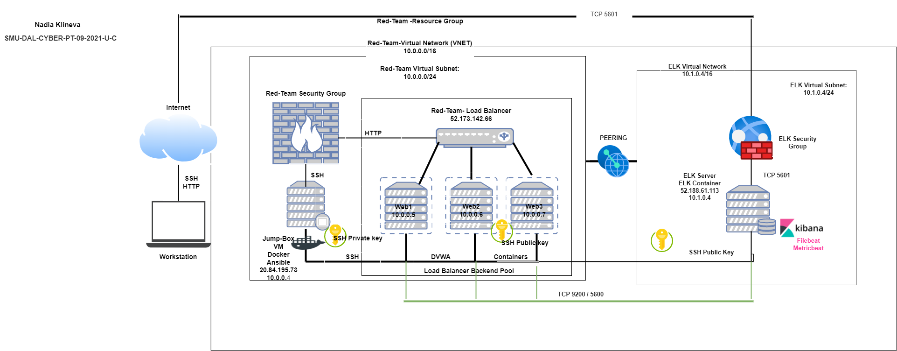

## Automated ELK Stack Deployment

The files in this repository were used to configure the network depicted below.

These files have been tested and used to generate a live ELK deployment on Azure. They can be used to either recreate the entire deployment pictured above. Alternatively, select portions of the YAML file may be used to install only certain pieces of it, such as Filebeat.

  - [ELK Installation](https://github.com/russianrobot2021/ELK-stack-deployment/blob/main/Ansible/ELK-playbook.yml.yml) 

  - [Filebeat and Metricbeat installation](https://github.com/russianrobot2021/ELK-stack-deployment/blob/main/Ansible/Mericbeat-filebeat-playbook.yml.yml)

This document contains the following details:
- Description of the Topology
- Access Policies
- ELK Configuration
  - Beats in Use
  - Machines Being Monitored
- How to Use the Ansible Build

### Description of the Topology

The main purpose of this network is to expose a load-balanced and monitored instance of DVWA, the Damn Vulnerable Web Application.
Load balancing ensures that the application will be highly functional and available, in addition to restricting traffic to the network. 

What aspect of security do load balancers protect? 
Load balancers add resiliency by rerouting live traffic from one server to another if a server falls prey to a DDoS attack or otherwise becomes unavailable.

What is the advantage of a jump box?
A Jump Box is also important as it prevents Azure VMs from being exposed via a public IP Address. This allows us to do monitoring and logging on a single box. We can also restrict the IP addresses able to communicate with the Jump Box, as we've done here.

Integrating an ELK server allows users to easily monitor the vulnerable VMs for changes to the network and system logs.

What does Filebeat watch for?
Filebeat monitors the log files or locations that you specify, collects log events, and forwards them either to Elasticsearch or Logstash for indexing.

What does Metricbeat record?
Metricbeat takes the metrics and statistics that it collects and ships them to the output that you specify, such as Elasticsearch or Logstash

The configuration details of each machine may be found below.

| Name      | Function     | IP address               | Operating system |
|-----------|--------------|--------------------------|------------------|
| Jump-box  | Gateway      | 10.1.0.4 / 20.85.232.66  | Linux            |
| Web-1     | UbuntuServer | 10.1.0.5 / 40.114.124.38 | Linux            |
| Web-2     | UbuntuServer | 10.1.0.6 / 40.114.124.38 | Linux            |
| DVWA-VM3  | UbuntuServer | 10.1.0.7 / 40.114.124.38 | Linux            |
| ELKserver | UbuntuServer | 10.2.0.4 / 20.84.136.248 | Linux            |

### Access Policies

The machines on the internal network are not exposed to the public Internet. 
Only the Jump-Box machine can accept connections from the Internet. Access to this machine is only allowed from the following IP addresses:
Add whitelisted IP addresses: 20.85.232.66
Workstation MY Public IP through TCP 5601

Machines within the network can only be accessed by Workstation and Jump-Box-Provisioner through SSH Jump-Box.
Which machine did you allow to access your ELK VM?
Jump-Box IP: 10.1.0.4 via SSH port 22
What was its IP address?
Workstation MY Public IP via port TCP 5601

A summary of the access policies in place can be found in the table below.

| Name      | Publicity Accessible | Allowed IP Addressed                    |
|-----------|-----------------------|-----------------------------------------|
| Jump Box  | Yes                   | 20.85.232.66 (Workstation IP on SSH 22) |
| Web-1     | No                    | 10.1.0.4 on SSH 22                      |
| Web-2     | No                    | 10.1.0.4 on SSH 22                      |
| DVWA-VM3  | No                    | 10.1.0.4 on SSH 22                      |
| ELKserver | No                    | Workstation MY Public IP using TCP 5601 |
### Elk Configuration

Ansible was used to automate configuration of the ELK machine. No configuration was performed manually, which is advantageous because...
What is the main advantage of automating configuration with Ansible?

There are multiple advantages, Ansible lets you quickly and easily deploy multitier applications through a YAML playbook.
You don't need to write custom code to automate your systems.
Ansible will also figure out how to get your systems to the state you want them to be in.

The playbook implements the following tasks:
 In 3-5 bullets, explain the steps of the ELK installation play. E.g., install Docker; download image; etc.
 
 Specify a different group of machines:
  - name: Config elk VM with Docker
    hosts: elk
    become: true
    tasks:

Install Docker.io
  - name: Install docker.io
    apt:
      update cache: yes
      force_apt_get: yes
      name: docker.io
      state: present
      
Install Python-pip
  - name: Install python3-pip
    apt:
      force_apt_get: yes
      name: python3-pip
      state: present

    # Use pip module (It will default to pip3)
  - name: Install Docker module
    pip:
      name: docker
      state: present
      `docker`, which is the Docker Python pip module.
      
  Increase Virtual Memory
 - name: Use more memory
   sysctl:
     name: vm.max_map_count
     value: '262144'
     state: present
     reload: yes
     
 Download and Launch ELK Docker Container (image sebp/elk)
 - name: Download and launch a docker elk container
   docker_container:
     name: elk
     image: sebp/elk:761
     state: started
     restart_policy: always
     
 Published ports 5044, 5601 and 9200 were made available
     published ports:
       -  5601:5601
       -  9200:9200
       -  5044:5044   
         
The following screenshot displays the result of running `docker ps` after successfully configuring the ELK instance.

### Target Machines & Beats
This ELK server is configured to monitor the following machines:
List the IP addresses of the machines you are monitoring
Web-1: 10.1.0.5
Web-2: 10.1.0.6
DVWA-VM3: 10.1.0.7

We have installed the following Beats on these machines:
http://52.188.61.113:5601/app/kibana#/home/tutorial/dockerMetrics
These Beats allow us to collect the following information from each machine:
In 1-2 sentences, explain what kind of data each beat collects, and provide 1 example of what you expect to see. E.g., `Winlogbeat` collects Windows logs, which we use to track user logon events, etc._
Filebeat will be used to collect log files from very specific files such as Apache, Microsoft Azure tools and web servers, MySQL databases.
Metericbeat will be used to monitor VM stats, per CPU core stats, per filesystem stats, memory stats and network stats

### Using the Playbook
In order to use the playbook, you will need to have an Ansible control node already configured. Assuming you have such a control node provisioned: 

SSH into the control node and follow the steps below:
- Copy the YAML file to ansible folder.
- Update the config file to include remote users and ports.
- Run the playbook and navigate to Kibana to check that the installation worked as expected.

- Which file is the playbook? Where do you copy it?
The playbook is install-elk.yml, copy of the file in inside /etc/ansible
- Which file do you update to make Ansible run the playbook on a specific machine? How do I specify which machine to install the ELK server on versus which to install Filebeat on?
The file you update is the hosts file, you add the ip address of the machine you want to install filebeat or ELK on to the group listed in the host file. 
- Which URL do you navigate to in order to check that the ELK server is running?
Go to http://ELK.VM.PUB.IP:5601/kibana

_As a **Bonus**, provide the specific commands the user will need to run to download the playbook, update the files, etc._